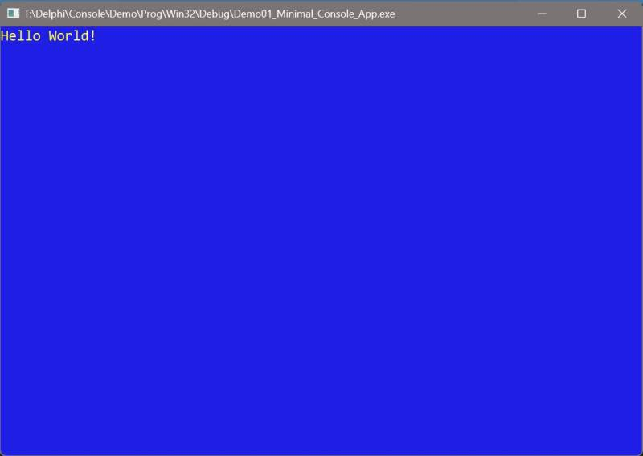
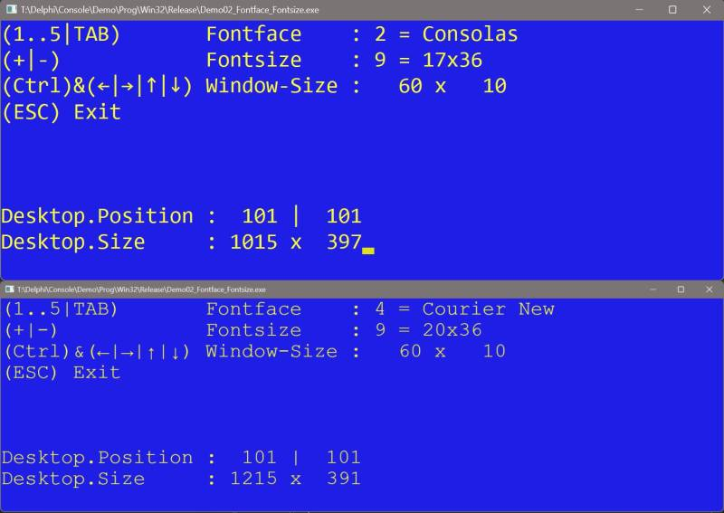
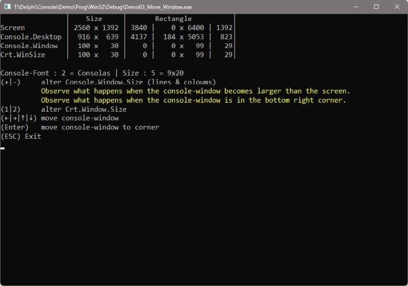
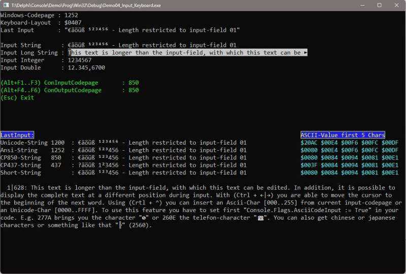
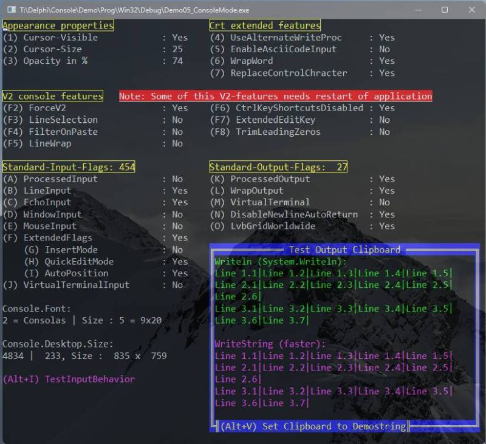
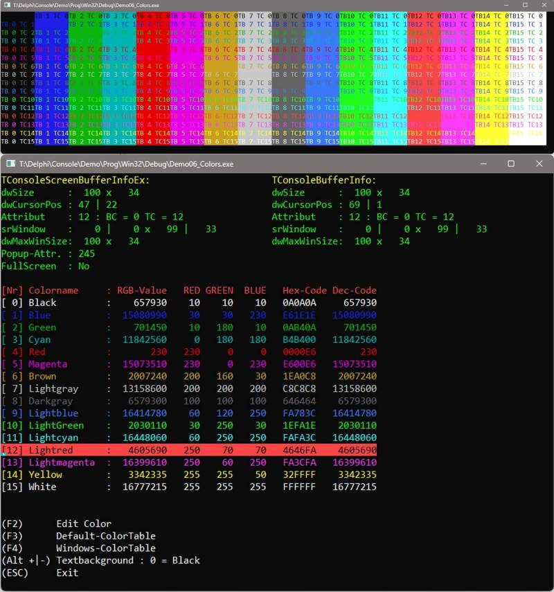
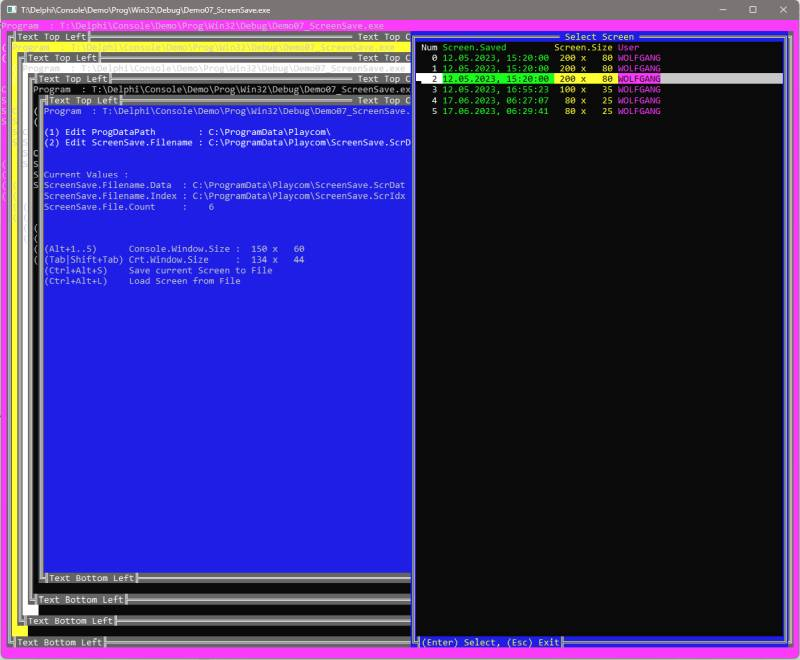
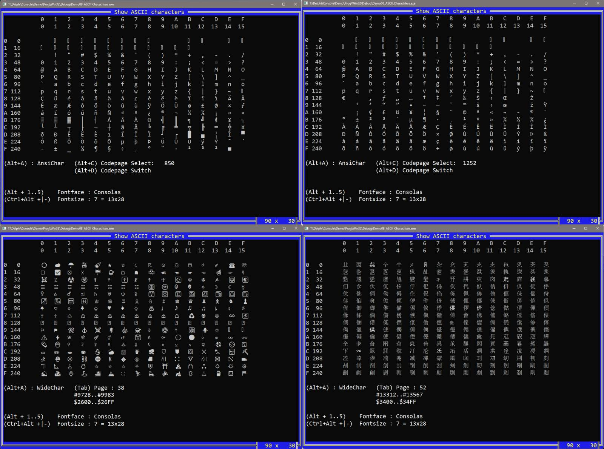

# Playcom Console Library

**Purpose:** 

Library for Delphi-Console-Applications | Supports Windows 11 (and earlier)

 - Can be used to write modern and appealing console applications.
 - Should allow older (legacy) source code (Borland Pascal 7.0) to run under Windows. 

**Usage:** 

Include the location of the unit "crt.pas" to the searchpath in your project settings and add the unit to the uses-clauses of your project. For the use of extended functions of the library it could be necessary to add further units (e.g. "ply.console.pas", or "ply.console.extended.pas") to the uses-clauses. To demonstrate the use of the library, I have added [Demo-Applications](Demo).  

**Feature-List:**
 - Largely compatible with legacy code (Borland Pascal 7.0)
 - Different fonts and font sizes
 - Any size of the console window
 - Enhanced Input- and Output-Functions
 - FrameWindow & LineSelect
 - Extended color-support (16 background colors, colorcodes freely selectable)  
 - Underline & Outline Text 
 - Full keyboard support
 - AnsiString and UnicodeString support (including e.g. chinese characters)
 - ScreenSave & ScreenRestore (save to memory or disk)
 - Move console-window on any position on the desktop (includes multi-monitor-support)
 - Change all console-modes (LineWarp, Opacity, QuickEditMode, etc.) directly from the software
 - and many more

**Minimal Console-App:**

```pascal
program Demo01_Minimal_Console_App;
uses crt;
begin
  TextBackground(White);
  Textcolor(Red);
  ClrScr;
  Writeln('Hello World!');
  Readkey;
end.
```

**Contributions:**

Contributions are welcome, either as Pull Requests or bug reports. If you want to report a bug or you are missing a feature, contact me by email (wolfgang[at]playcom.de).

**Screenshots:**















